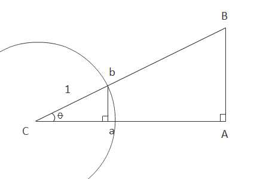

# Trigonometry

## Units of Measure

Most people are used to using degrees to measure angles. A triangle contains 180° and a circle has 360°. However, there is another unit of measure that is used for Angles. This other unit is called a radian. In a triangle there are approximately 3.1415 radians (π radians) and in a circle there are approximately 6.283 radians (2π  radians).

Here is a quick video from Khan Academy that talks about radians. If my explaination is not clear please watch this: [Khan Academy Lesson on Radians](https://www.khanacademy.org/math/trigonometry/basic-trigonometry/radians_tutorial/v/introduction-to-radians)

## Trigonometric functions

The three most common Trig functions are Sin, Cos, and Tan. These are the ones that you would have learned back in high school.

The Sine of an angle inside a right-angled triangle is equal to the ratio of the opposite side to the angle and the hypotenuse (longest) side of the triangle.

The Cosine of an angle inside a right-angled triangle is equal to the ratio of the adjacent side and the hypotenuse.

The Tangent of an angle inside a right-angled triangle is equal to the ratio of the opposite and adjacent sides.

This is where the mnemonic SOH CAH TOA comes from.

Khan Academy has a great bunch of video tutorials on basic Trig.

I encourage you to watch this [first video all about SOH CAH TOA](https://www.khanacademy.org/math/trigonometry/basic-trigonometry/basic_trig_ratios/v/basic-trigonometry)

## Angles in Circles

Whether an angle is in a triangle or inside a circle or an arc (which is just part of a circle), it is still just a measurement.

When we want to calculate a distance between two points and we know what the angle between those points is then we can use our understanding of basic SOH CAH TOA to calcuate the distance.

Let's use this image as reference for the last part of this explanation. The three corners are labelled with the captial letters - A, B, and C. The sides are labelled with lowercase letters - a, b, and c. The main angle, at the center of the circle, is called theta - θ

 

In this image there is a circle whose radius is set to one. If we create a right angle triangle using the radius of 1 as our hypotenuse then we can use our SOH CAH TOA calcuations from above to calculate the length of the line along any angle.

Inside the circle, whose radius is 1, we have created a right angle triangle. The Hypotenuse of the triangle will always be 1.

To calculate the length of the line segments Ca or ba we will use:

```
Sin( θ ) = O / H  
```

and

```
Cos( θ ) = A / H 
```

We know that the Hypotenuse (H) will always be 1. Divide any number by 1 and you are left with the original number.

So, as long as we know the angle represented by \theta θ then we can solve for Opposite (O) or Adjacent (A).

Opposite is the line ba. Adjacent is the line Ca.

```
Sin( θ ) = O
Cos( θ ) = A
```

The line segment Ca is our distance along the X axis to get from point C to point b.

The line segment ba is our distance along the Y axis to get from point C to point b.

In Javascript we would write this as:

```js
var rad = 1.2;  //Our angle is measured in radians. I randomly picked 1.2 radians.
var deltaX = Math.cos( rad);
var deltaY = Math.sin(rad);
```

So, to get from point C, which we will refer to as point `(0,0)` to point b we need to move deltaX along the X axis and deltaY along the Y axis.

## Expanding our Line

So, we know how to calculate the length from C to b. However, not every line we want will have a hypotenuse of one.

The solution for longer lines is actually quite simple. Referring back to our document lets say we wanted to go from point C to point B. We need to calculate the lengths of CA and AB. 

Since our Angle θ never changes it means that the ratio between the three sides will not change either. If CB is 2.5 times as long as Cb that means that CA is 2.5 times longer than Ca and AB is 2.5 times longer than ab.

If you know that you want to have the line CB be 80px long and you know that Cb is always 1 then just multiply our earlier values for deltaY and deltaX by 80 and we have our final answer for the coordinates of point B.

```js
var rad = 1.2;  //Our angle is measured in radians. I randomly picked 1.2 radians.
var distance = 80;
var deltaX = Math.cos( rad) * distance;
var deltaY = Math.sin(rad) * distance;
```

That's it. All done. To get from our center point to the new location we have to move horizontally by deltaX and vertically by deltaY.

The other really cool thing about this is that our COS and SIN functions will give us negative or positive values which will determine which direction we need to move horiztonally or vertically.

Last step is doing this on the Canvas. Let's say that we want to draw a pie-wedge shape and then draw a line from the center point, through the middle of the arc, out to 50px beyond the arc of the pie wedge.

```html
<canvas id="pie" height="400" width="400"></canvas>

<script>
    var canvas = document.querySelector("#pie");
    var ctx = canvas.getContext("2d");
    var cx = 200;
    var cy = 200;  //center point of canvas, middle of our circle
    var radius = 50;

    ctx.fillStyle="rgb(160,204,20)";
    ctx.moveTo(cx, cy);
    ctx.beginPath();
    ctx.arc(cx, cy, radius, 1.1, 2.5, false);  //arc from 1.1 to 2.5 radians.
    ctx.lineTo(cx, cy);
    ctx.fill();
    //arc is done now

    //now draw the line
    var midAngle = (1.1 + 2.5)/2;
    ctx.save();
    ctx.translate(cx, cy);   //make the middle of the circle the (0,0) point
    //calculate the new end point

    ctx.strokeStyle = "#333";
    ctx.lineWidth = 2;
    ctx.beginPath();
    ctx.moveTo(0,0);
    var dx = Math.cos(midAngle) * (radius + 50);
    var dy = Math.sin(midAngle) * (radius + 50);
    ctx.lineTo(dx, dy);
    ctx.stroke();

    ctx.restore(); //put the (0,0) point back where it was
</script>
```

## Find the Angle from the Coordinates

So, what about the `TOA` part of `SOH CAH TOA`?

What if we have the coordinates of the point on the outside of the circle and we have the coordinates for the center of the circle but we need to know the angle?

We can solve this using the `tangent` function, or rather, the `arctangent` function. We know from above that the result of `Math.tan(theta)` will be the same as the value of the length of the `Opposite` side divided by the length of the `Adjacent` side. - TOA.

If you know what the value of the `Opposite` divided by the `Adjacent` is (let's call this value `ratio`) then you can give that number to the `Math.atan(ratio)` function and it will tell us the angle in radians.

JavaScript actually has TWO `arctangent` methods. `Math.atan()` and `Math.atan2()`, They can both be used to find the angle. You can call the `atan` method and pass it the one number, the `ratio`. OR you can call the `atan2` method and pass it two numbers, the x value and the y value. They both give the same result.

In practical terms, when doing this on the canvas element, we need to remember to subtract the x and y values of the center of the circle from our x and y point. `atan` and `atan2` work but assume that the center of the circle is at (0,0).

```js
let cx = 300; //center of the circle
let cy = 300; //center of the circle
let x = 390; //the x coord on the circle
let y = 320; //the y coord on the circle

let theta1 = Math.atan( (y-cy) / (x-cx) ); //version 1 divides the y difference by the x difference

let theta2 = Math.atan2( x-cx, y-cy ); //version 2 just accepts the two differences

//the values of theta1 and theta2 should be the exact same.
//this is your angle, in radians
```
Once you have that angle, you can rotate something to face the direction of that (x, y) point.
