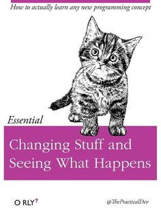
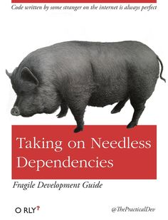
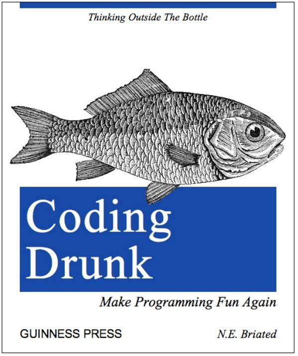

# Useful Books

Here is a list of books that every web developer should have.

<section style="display: flex; 
            flex-direction: row;
            flex-wrap: wrap;
            justify-content: flex-start;
            align-items: flex-start;
            margin-bottom: 2rem;
            max-width: 600px;">

</section>